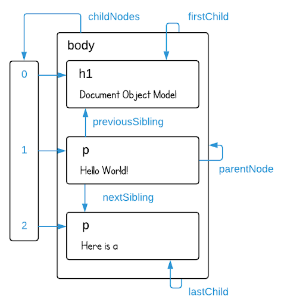

# santander-backend-js
## Curso en BEDU de javaScript


### contenido
* [Objetos](### Sesión 3: Objetos y Arreglos)
* [Funciones]


### [Documentacion JavaScript](https://developer.mozilla.org/es/docs/Web/JavaScript/Guide)


### Sesión 3: Objetos y Arreglos
- **Arreglos**
- **Objetos**
    [Documentacion](https://developer.mozilla.org/es/docs/Web/JavaScript/Guide/Working_with_Objects)
- **Spread operator**
    - *const copyOfBook = { ...book };*
`for of no se puede usar en objetos`

- ***Para crear un objeto***
    - **Iniciador de objeto**
        un iniciador de objeto a veces se denomina crear objetos con notación literal 
        ```
        var obj = { property_1:   value_1,   // property_# puede ser un identificador...
                    2:            value_2,   // o un número...
                    // ...,
                    'property n': value_n }; // o una cadena
        ```
    - **Usar una función constructora**
        ```
        function Car(make, model, year) {
            this.make = make;
            this.model = model;
            this.year = year;
        }
        ```
    - **Usar el método Object.create**
        Los objetos también se pueden crear por medio del método Object.create().

#### metodos utiles en arreglos:
arreglo.sort() -> ordena el array


#### metodos utiles en objetos:
* objeto.hasOwnProperty() -> devuelve un valor boleano si se encuentra la clave?
* Object.keys(o) -> devuelve un arreglo con todos los nombres de propiedades enumerables ("claves") propias (no en la cadena de prototipos) de un objeto o.
* Object.getOwnPropertyNames(o) Devuelve un arreglo que contiene todos los nombres (enumerables o no) de las propiedades de un objeto o.
* Object.create(o) -> crea un nuevo objeto
* Object.defineProperties(o, {'nuevaproperty': { function(){} }}); [agregar a un objeto en cualquier momento después de la creación](https://developer.mozilla.org/es/docs/Web/JavaScript/Guide/Working_with_Objects#definici%C3%B3n_de_captadores_getters_y_establecedores_setters)


#### Herencia

#### Definición de métodos
Un método es una función asociada a un objeto, o, simplemente, un método es una propiedad de un objeto que es una función.
```
objectName.methodname = functionName;
var myObj = {
    myMethod: function(params) {
        // ...hacer algo
    }

    // O ESTO TAMBIÉN FUNCIONA
    myOtherMethod(params) {
        // ...hacer algo más
    }
};
```
[definiciones de métodos](https://developer.mozilla.org/es/docs/Web/JavaScript/Reference/Functions/Method_definitions)
```
var obj = {
    property( parameters… ) {},
    *generator( parameters… ) {},
// also with computed keys:
    [property]( parameters… ) {},
    *[generator]( parameters… ) {},
// compare ES5 getter/setter syntax:
    get property() {},
    set property(value) {}
};
```
[Nombres de propiedad computados](https://developer.mozilla.org/es/docs/Web/JavaScript/Reference/Functions/Method_definitions#nombres_de_propiedad_computados)
`["foo" + 2](){return 2;},`

[Usar this para referencias a objetos](https://developer.mozilla.org/es/docs/Web/JavaScript/Guide/Working_with_Objects#usar_this_para_referencias_a_objetos)
this, que puedes usar dentro de un método para referirte al objeto actual

[Definición de captadores (getters) y establecedores (setters)](https://developer.mozilla.org/es/docs/Web/JavaScript/Guide/Working_with_Objects#definici%C3%B3n_de_captadores_getters_y_establecedores_setters)
Puedes definir captadores y establecedores en cualquier objeto principal predefinido o en un objeto definido por el usuario que admita la adición de nuevas propiedades. 
- definido usando iniciadores de objeto, o
- agregado posteriormente a cualquier objeto en cualquier momento usando un método de adición para el captador o el establecedor.

[Eliminar propiedades](https://developer.mozilla.org/es/docs/Web/JavaScript/Guide/Working_with_Objects#eliminar_propiedades)
`// Elimina la propiedad a, dejando a myobj solo con la propiedad b.
delete myobj.a;`


### Sesión 4: Funciones
- **funcion**
 conjunto de sentencias que realizan una tarea sin repetir codigo
 declaración de función: 
>  `function myFunction(parameter1, parameter2) {
        // Código a ejecutar
    }`
expresión de función:
>  `const square = function(number) {
        return number * number;
    }`
>  `const factorial = function fac(num) {
        return num < 2 ? 1 : num * fac(num - 1)
    }`

> **argumento** es el valor dado a una funcion, **parametro** es la variable que recibe ese valor dentro de la funcion
- **Expresion de funcion ejecutada inmediatamente (IIFE)**
>  `(function(lastName) {
        const firstName = "John";
        console.log(`${firstName} ${lastName}`);
    })('Doe');`
- **arrow functions**
- **Return implicito**


### Sesión 5: Scope 
Para evitar confusiones, el `scope` se refiere a la visibilidad de variables mientras que el `contexto` se refiere al valor de this. Es decir, conforme cambia el execution context también lo hace el objeto this

inmutavilidad de una constante: 

Scope se refiere al alcance que tienen las variables, es decir, limita desde dónde podemos acceder a una variable. Por otro lado, Context se refiere al valor que tiene this el cual puede cambiar.

Podemos asociar el Execution Context con un objeto que tiene tres propiedades: `Variable Object`, el cual contiene los argumentos de la función, declaraciones de variables internas y declaraciones de funciones. `Scope Chain`, este contiene el Variable Object del Execution Context actual así como el de los padres. Por último la variable `this`.
Scope chain ->  

`Hoisting`. En este punto aún no llegamos a la fase de ejecución, es decir, el código de nuestra función aún no se ejecuta, sin embargo, ya tenemos acceso a las funciones y las variables son inicializadas con undefined.


### Sesión 6: POO
>POO Programacion Orientada a Objetos

[Documentacion](https://developer.mozilla.org/es/docs/Web/JavaScript/Guide/Details_of_the_Object_Model)

Creación de la jerarquía


**Programación imperativa**
Describe paso a paso un conjunto de instrucciones necesarias para solucionar el problema. Se enfoca en describir el cómo se llega a la solución.
- __Programación orientada a objetos__: Se encapsulan tanto variables como funciones en objetos.


**Programación declarativa**
Se describe el problema que se pretende solucionar. Está más enfocado en el qué solución se desea alcanzar.
- __Programación funcional__: Está basado en las funciones matemáticas, lo que permite hacer uso de mecanismos matemáticos para optimizar procesos.

**lenguajes multiparadigma**: Que te permiten crear programas con múltiples estilos de programación

**ES6 Classes**
```
class Person {
  constructor(name, birthYear, job) {
    this.name = name;
    this.birthYear = birthYear;
    this.job = job;
  }
	
  calculateAge() {
    const today = new Date();
    const year = today.getFullYear();
    console.log( year - this.birthYear );
  }
}
```

**Metodos estaticos**
[Metodos](https://developer.mozilla.org/es/docs/Web/JavaScript/Inheritance_and_the_prototype_chain)

[Variables estaticas en JS](https://qastack.mx/programming/1535631/static-variables-in-javascript)

[Static properties and methods](https://javascript.info/static-properties-methods)

### Sesión 7: Webpack

figma
balsamiq

### Sesión 8: DOM (Document Object Model)

El **DOM** tiene una estructura de _árbol_. Crea un modelo el cual se guarda en una variable global llamada _document_.
> `document` es una variable global, es decir, se puede acceder a ella desde cualquier parte del script o código. Todas las funciones que hagas pueden hacer referencia a esta variable

_Todos los nodos tienen una propiedad `parentNode` que apunta al nodo que lo contiene. La propiedad `childNodes` apunta a un objeto parecido a un arreglo que contiene los hijos del nodo. Las propiedades `firstChild` y `lastChild` apuntan al primer y último nodo hijo respectivamente o null si no tienen. De igual forma, `previousSibling` y `nextSibling` apuntan a los nodos hermanos, es decir, los nodos adyacentes que comparten el mismo padre._


`parentNode.propiedad('css selectors')`

| Propiedades | Descripcion   |
|-------------|---------------|
| .getElementsByTagName| Regresa un objeto similar a un arreglo con todos los elementos descendientes que contengan la etiqueta proporcionada como argumento.|
| .getElementsByClassName| Regresa un objeto similar a un arreglo con todos los elementos descendientes que contengan la clase proporcionada como argumento.|
| .getElementById | Regresa el elemento que contenga el id proporcionado como argumento.|
| .querySelector | Regresa el primer elemento que haga match con el selector de CSS proporcionado como argumento.|
| .querySelectorAll | |
| .appendChild | --|
| .insertBefore | v|
| .replaceChild(newChild, oldChild) | Para reemplazar un nodo hijo por otro: reciben dos argumentos(nuevo nodo, viejo nodo) |
| .remove | que los elimina del padre actual |
| .createElement | crea un nuevo nodo vacío del tipo que sea especificado en el argumento de la función |
| .createTextNode | Para agregar un texto a este nuevo nodo h1 primero debemos crear un nuevo nodo de texto |
| .children | hijos |
| .replaceChildren(...nodesOrDOMStrings) | Reemplaza the existing children of a Node with a specified new set of children |


## Sesión 11: Programación asíncrona

JavaScript es un lenguaje de programación de un solo thread, es decir, no podemos usar varios procesadores. El motor de JavaScript solo puede procesar una sentencia a la vez en un único thread.

### Asincronía

Mediante el uso de callbacks, promesas y async/await podemos realizar operaciones con largos tiempos de respuesta sin bloquear el thread principal.

> Main thread: Task A                   Task B
    Promise:        |__async operation__|

### Callbacks

Un callback es una función que se pasa como argumento a otra función para que sea ejecutada al final de algún proceso

```javascript
const callback = () => console.log('Hello World');

setTimeout(callback, 0);
```

En resumen, `setTimeout` retrasa la ejecución de la función callback como mínimo la cantidad especificada de tiempo en milisegundos. Asignar un tiempo de **0ms no** significa que el callback se **ejecuta** de manera **inmediata**.

- Callback hell
```javascript
    function startProcess() {
    console.log('Start Phase 1. Wait one second...');
    setTimeout(function () {
        console.log('Phase 1 completed. Wait two seconds...');
        setTimeout(function () {
        console.log('Phase 2 completed. Wait three seconds...');
        setTimeout(function () {
            console.log('Phase 3 completed. Wait four seconds...');
            setTimeout(function () {
            console.log('Phase 4 completed.');
            // More asynchronous calls...
            }, 4000);
        }, 3000);
        }, 2000);
    }, 1000);
    }

    startProcess();
```
A esto se le conoce como callback hell. Al continuar anidando varios callbacks comenzamos a restar legibilidad a nuestro código, encontrar bugs y resolverlos se hace más tedioso, en general estamos agregando complejidad ciclomática.

> *Complejidad ciclomática* es una métrica que mide el número de caminos o flujos independientes dentro de un fragmento de código. Entre mayor sea esta métrica el código es más complejo, difícil de leer, entender, modificar y mantener.


### Promesas
Una promesa es una acción asíncrona que podría cumplirse en algún momento y producir un valor. En cierta forma es igual a los callbacks, pero con una mejor sintaxis que facilita la legibilidad.
Podemos obtener el resultado de una promesa usando el método then, este registra una función callback para ser llamada cuando la promesa se resuelve y produce un valor.

```javascript
    function foo() {
    return new Promise((resolve) => {
        // Async operations...
        resolve(value);
    })
    }

    foo().then(value => console.log(value)); // value created in foo()
    foo()
        .then(value => console.log(value)) // if promise is rejected we skip this
        .catch(error => console.log(error)) // error produced in foo()
```
```javascript
    function foo() {
    return new Promise((resolve, reject) => {
        // Async operations...
        reject(new Error('Process Failed'));
    })
    }

    foo()
    .then(value => console.log(value))
    .catch(error => console.log(error)); // error produced in foo()
```

### Async/await
Al colocar el keyword async en la declaración de una función, estamos definiendo una función asíncrona. Esta función siempre retornará una promesa, esto significa que si el valor retornado no es una promesa automáticamente se envuelve dentro de una.

```javascript
    async function foo() {
    return Promise.resolve('Hello World');
    }

    foo().then(value => console.log(value)) // Hello World 
```
El keyword `await` solo puede ser usado dentro de funciones async nos permite esperar hasta que una promesa sea resuelta y retorne un valor.
```javascript
    function foo() {
    return new Promise((resolve) => {
        setTimeout(() => resolve('Hello World'), 1000)
    })
    }

    async function bar() {
    let result = await foo()
    
    console.log(result)
    }

    bar()
```
La función pausa su ejecución cuando encuentra un await y continua una vez que la promesa haya sido resuelta. Debemos envolver esta operación en un try...catch en caso que la promesa sea rechazada.

### 

## Sesión 12: API
### API
Application Program Interface o simplemente API es un contrato entre una porción de software y otra, donde la información se comparte de manera estructurada a través de request (petición) y response (respuesta).

### REST API
REST significa Representational State Transfer. Este es un estilo de arquitectura para diseñar aplicaciones en red que se basan en un protocolo cliente-servidor, usualmente es HTTP. Esto permite a una aplicación web realizar una petición HTTP a un servidor y obtener un response en cierto formato que en la mayoría de los casos es un JSON, una representación de un objeto de JavaScript.


### Métodos HTTP

### fetch


