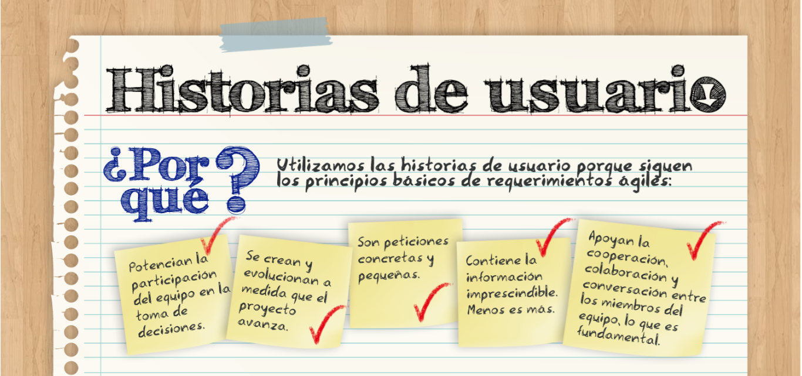

# Reto 3

_En equipos, definan los requerimientos de su proyecto. Para esto determinen el alcance que tendrá su aplicación, quienes son los agentes que intractúan en ella y las funciones de cada uno. Después, escriban un mínimo de 5 historias de usuario para definir los requerimientos de la aplicación._

> "Como [rol de usuario] quiero [objetivo] para [beneficio]"

## Historias de usuario

1. "Como [rol de usuario] quiero [objetivo] para [beneficio]"
1. 
1. 
1. 
1. 