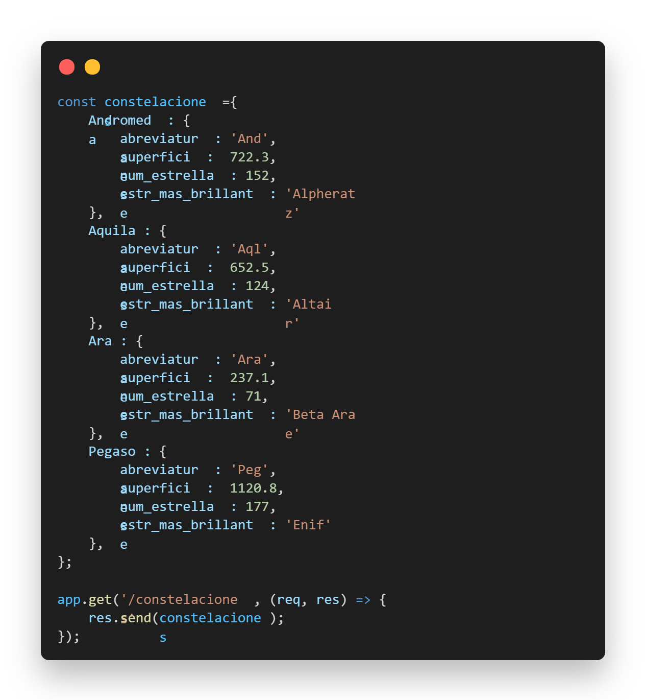
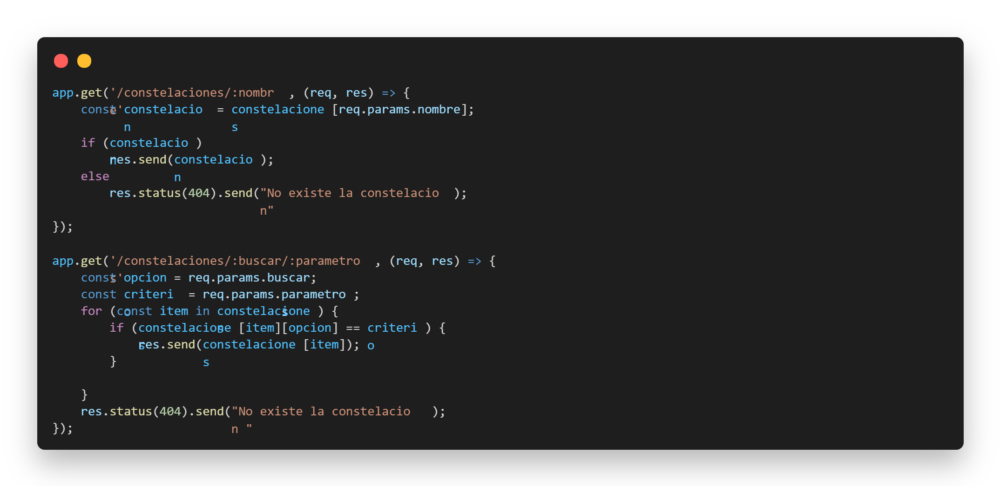

# Reto 1
_Define un objeto de objetos en donde almacenes a las constelaciones, cada objeto interno debe tener como llave el nombre de ésta y sus atributos deben ser abreviatura, superficie, num_estrellas y estr_mas_brillante._

1. Agrega al menos 2 constelaciones.
1. Define una nueva ruta para un GET de constelaciones con el nombre constelaciones.
1. Define el servicio que regrese la lista de todas las constelaciones definida en el inciso 1.


```javascript
const constelaciones ={
    Andromeda : {
        abreviatura : 'And',
        superficie :  722.3,
        num_estrellas : 152,
        estr_mas_brillante : 'Alpheratz' 
    },
    Aquila : {
        abreviatura : 'Aql',
        superficie :  652.5,
        num_estrellas : 124,
        estr_mas_brillante : 'Altair' 
    },
    Ara : {
        abreviatura : 'Ara',
        superficie :  237.1,
        num_estrellas : 71,
        estr_mas_brillante : 'Beta Arae' 
    },
    Pegaso : {
        abreviatura : 'Peg',
        superficie :  1120.8,
        num_estrellas : 177,
        estr_mas_brillante : 'Enif' 
    },
};

app.get('/constelaciones', (req, res) => {
    res.send(constelaciones);
});
```


---

# Reto 2
1. Crea nuevos servicios dinámicos de búsqueda de constelaciones por:
- nombre
- abreviatura
> Hint: Define primero una función que busque un elemento dentro de un objeto por cierto atributo.

1. Prueba que funcionen en Insomnia


```javascript
app.get('/constelaciones/:nombre', (req, res) => {
    const constelacion = constelaciones[req.params.nombre];
    
    if (constelacion) 
        res.send(constelacion);
    else
        res.status(404).send("No existe la constelacion");
    
});

app.get('/constelaciones/:buscar/:parametros', (req, res) => {
    const opcion = req.params.buscar;
    const criterio = req.params.parametros;
    for (const item in constelaciones) {
        if (constelaciones[item][opcion] == criterio) {
            res.send(constelaciones[item]);
        }
        
    }
    res.status(404).send("No existe la constelacion ");
});
```

---

# Reto 3
1. Completa los servicios de CRUD para constelaciones, en cada caso es necesario enviar explícitamente el código de respuesta, tanto de fallo como de éxito. Haz los servicios lo mas robustos posibles.

```javascript
app.put('/constelaciones/:name', (req,res) => {
    const constelacion = req.params.name;
    constelaciones[constelacion] = req.body;
    res.send(constelaciones);
});

app.post('/constelaciones', (req,res) => {
    const name = req.query.name;
    const info = req.body;
    constelaciones[name] = info;
    res.status(200).send(constelaciones);
});

app.delete('/constelaciones/:name', (req,res) => {
    const name = req.params.name;
    if (delete constelaciones[name]){
        res.send(constelaciones)
    } else {
        res.status(500)
    }
});
```