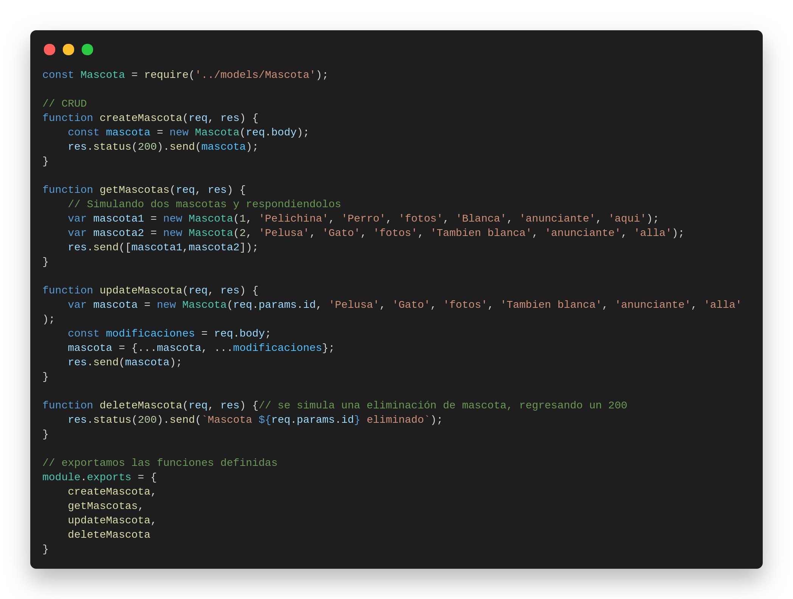
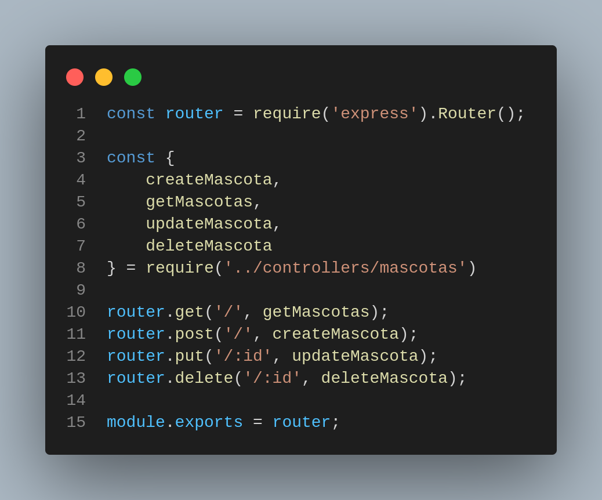
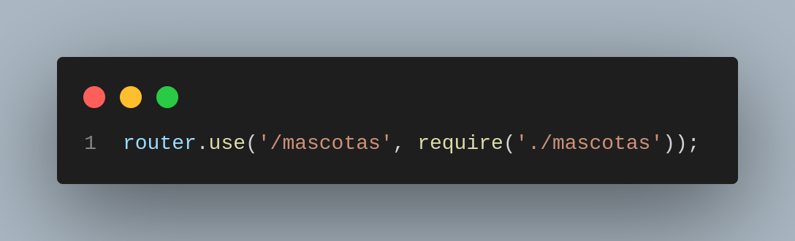
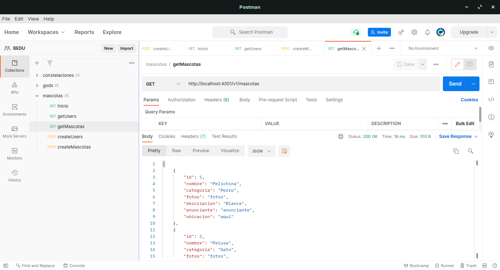

# Reto 1
_Crear el controador con la estructura CRUD para las mascotas de manera similar a lo que hicimos con el archivo routes/usuarios.js, no olvides usar el modelo que ya definimos para mascota._

---

# Reto 2
1. _Utilizando el controlador de Mascota que definimos en el reto anterior, define su Router y agregalo a routes/index.js._

1. _Una vez definidos prueba tus endopoints en insomnia o postman. Recuerda que ahora la ruta de nuestros servicios incluye la versión de la API v1. Por lo que se ve de la siguiente forma:_

---
