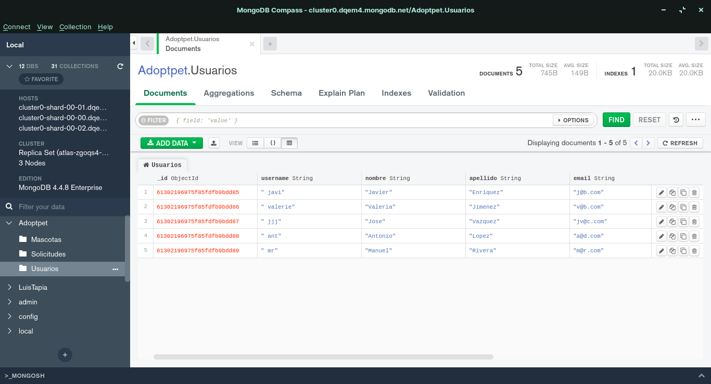
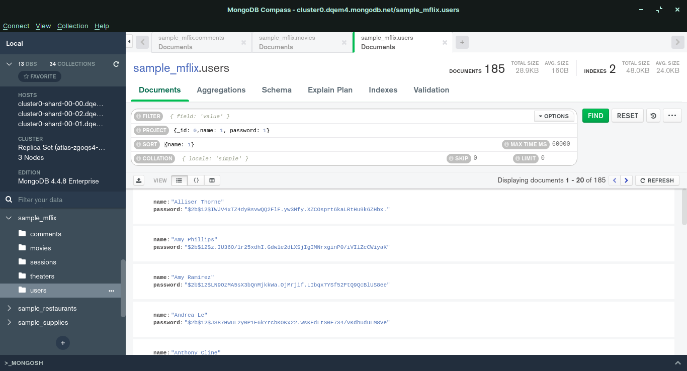
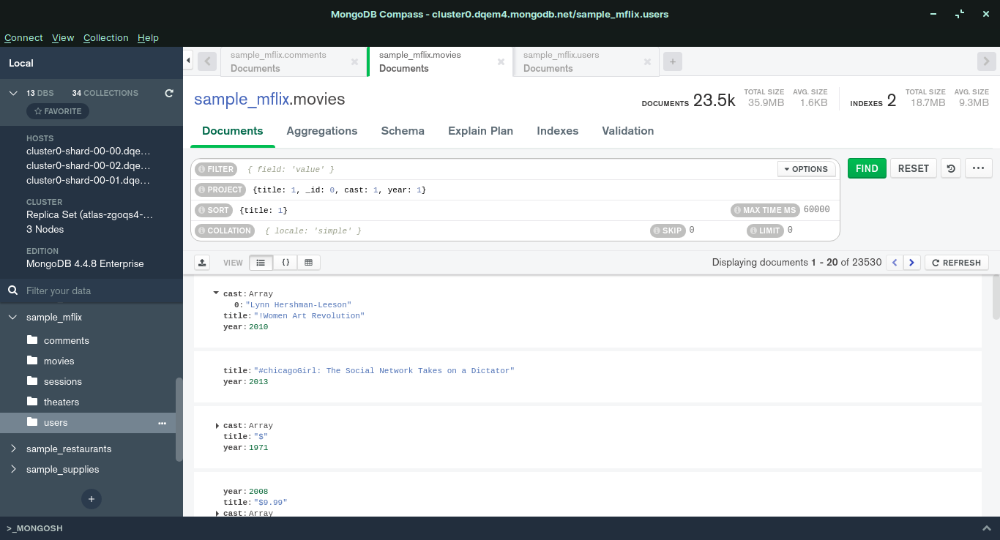
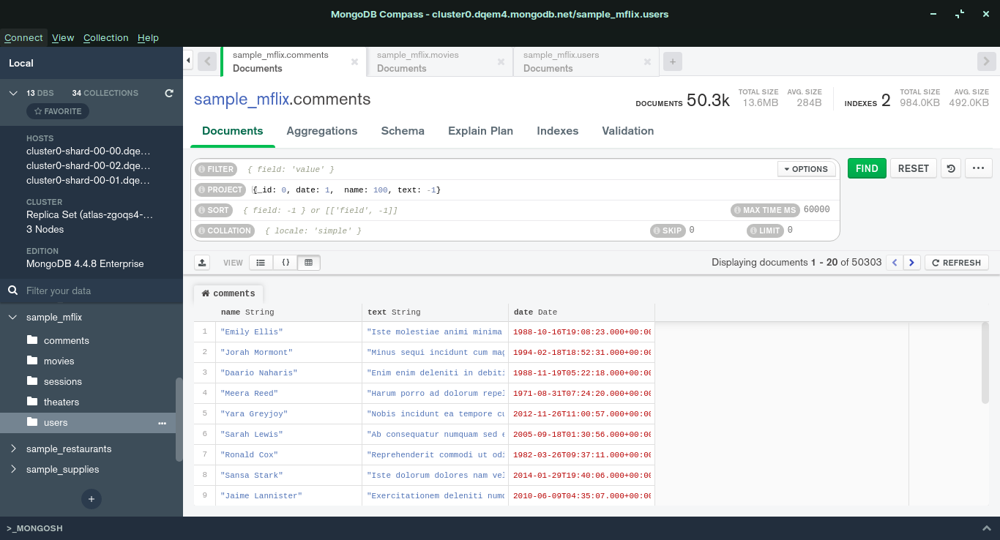

# Reto 1
Se deberá de crear colecciones e importar los datos.

1. Crear la colección Usuarios
1. Importar datos a la colección Usuarios desde el archivo usuarios.csv, verificando la concordancia entre los tipos de dato.
1. Crea la colección Solicitudes que en este momento dejaremos vacía.

---

# Reto 2
_Usando la base de datos sample_mflix, proyecta los datos que se solicitan._

- Fecha, nombre y texto de cada comentario.
	- {_id:0, date:1, name:1, text:1 }
- Título, elenco y año de cada película.
	- {_id:0, title:1, cast:1, year:1}
- Nombre y contraseña de cada usuario.
	- {_id:0, name:1, password:1}
	

---

# Reto 3
_Creación de la base de datos en SQL para Adoptapet._

1. _Define la base de datos para AdoptaPet_
1. _Define las tablas que representan las entidades de esta base de datos usando el modelo relacional del reto anterior._

---