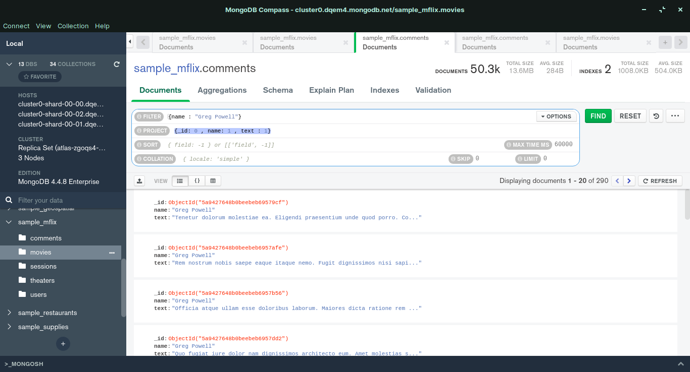
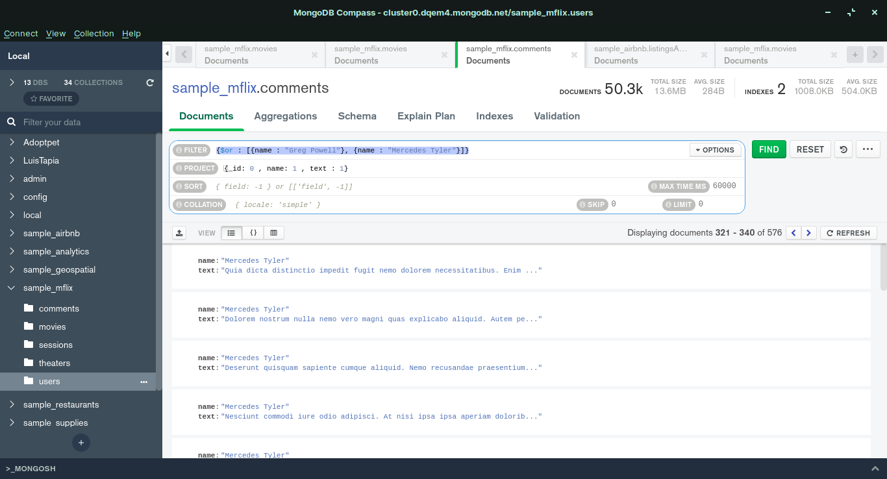
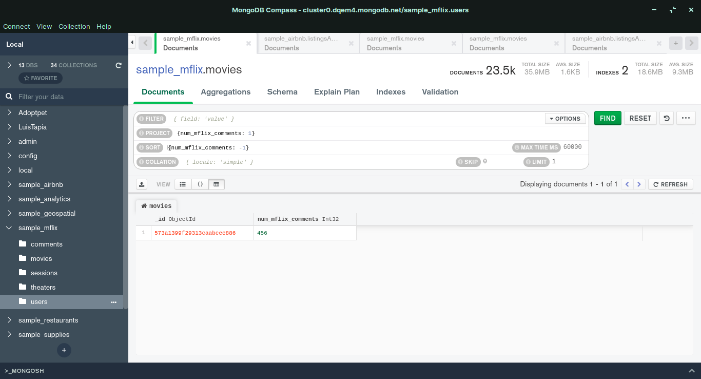
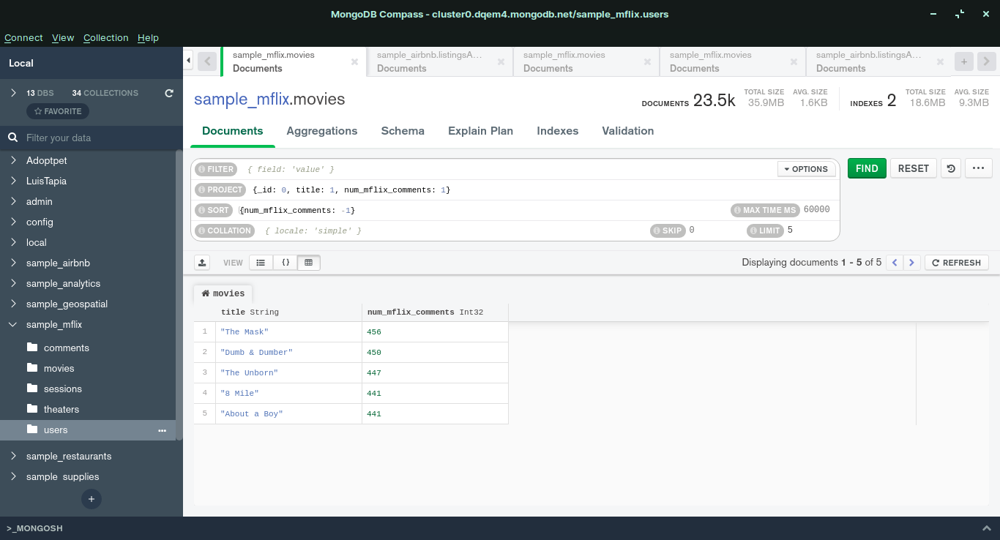

Usando la base de datos sample_mflix, agrega proyeccciones, filtros, ordenamientos y límites que permitan contestar las siguientes preguntas:

¿Qué comentarios ha hecho Greg Powell?
{name : "Greg Powell"}
{_id: 0 , name: 1 , text : 1}

¿Qué comentarios han hecho Greg Powell o Mercedes Tyler?
{$or : [{name : "Greg Powell"}, {name : "Mercedes Tyler"}]}

¿Cuál es el máximo número de comentarios en una película?

¿Cuál es título de las cinco películas más comentadas?
