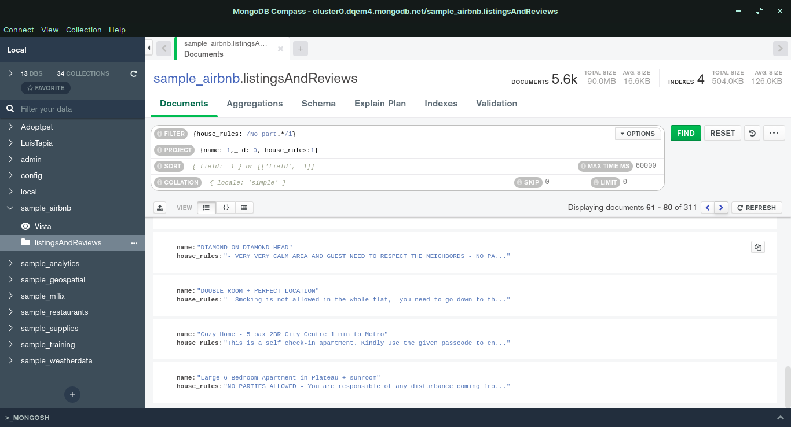
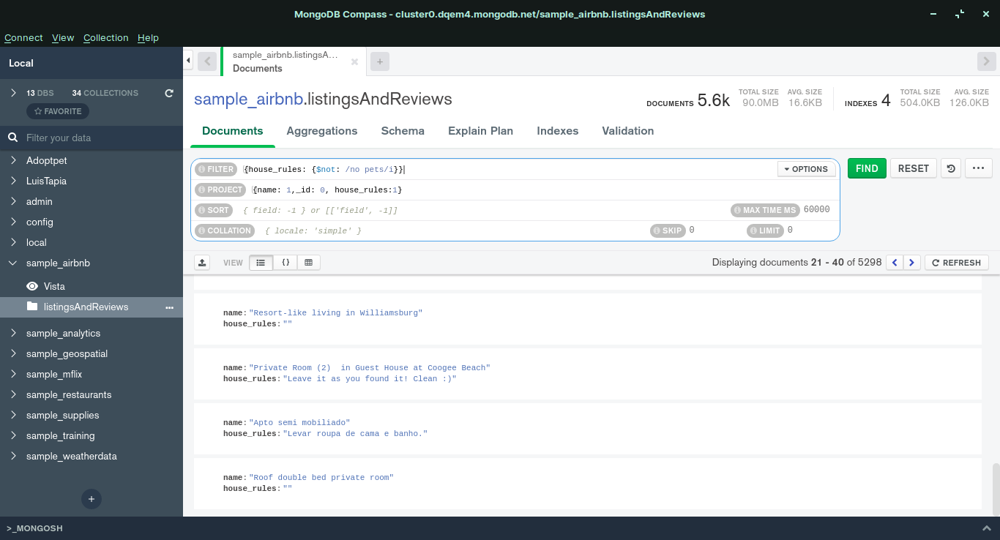
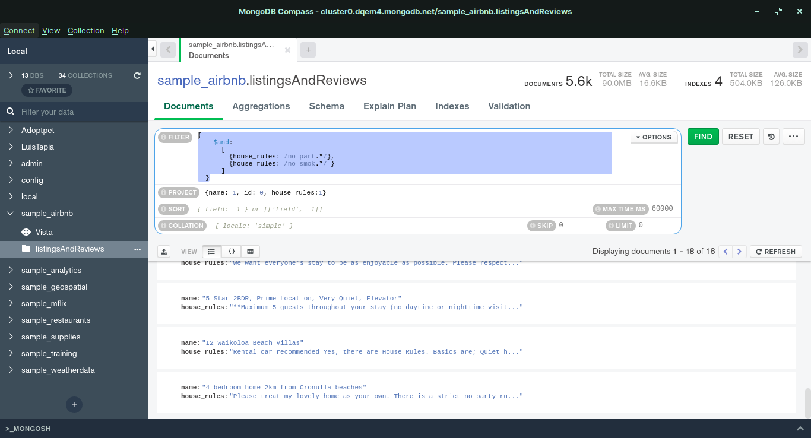

Usando la base de datos sample_airbnblistingsAndReviews, realiza los siguientes filtros:

1. Propiedades que no permitan fiestas.
{house_rules: /No part.*/i}
{name: 1,_id: 0, house_rules:1}

1. Propiedades que admitan mascotas.
{house_rules: {$not: /no pets/i}}
{name: 1,_id: 0, house_rules:1}

1. Propiedades que no permitan fumadores.
{house_rules: /no smok.*/i}
{name: 1,_id: 0, house_rules:1}

1. Propiedades que no permitan fiestas ni fumadores.
{ 
    $and: 
      [ 
        {house_rules: /no part.*/}, 
        {house_rules: /no smok.*/ } 
      ] 
  }
{name: 1,_id: 0, house_rules:1}

