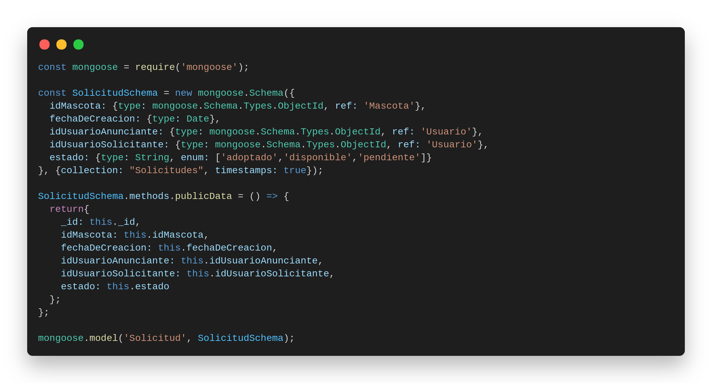

# RETO 1
_Siguiendo el ejemplo anterior define el modelo para la solicitud de adopción de una Mascota._

Es importante notar que en este esquema se tienen que considerar las referencias a la mascota que se quiere adoptar y a los usuarios tanto el que va a adoptar a la mascota como el que la puso en adopción.

Recordemos que cuando definimos la base de datos desde mongo, no creamos una colección para almacenar las solicitudes. Tomando esto en cuenta, discutan que creen que pasará al crear un documento para esta colección desde la API.

R: Se crea la colección

# RETO 2

